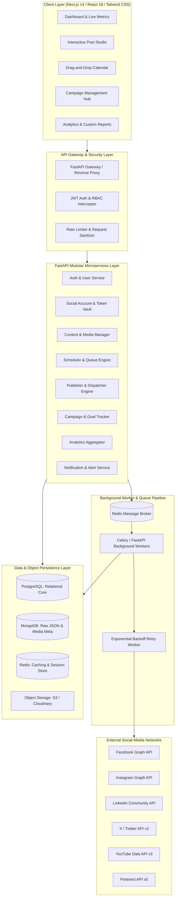
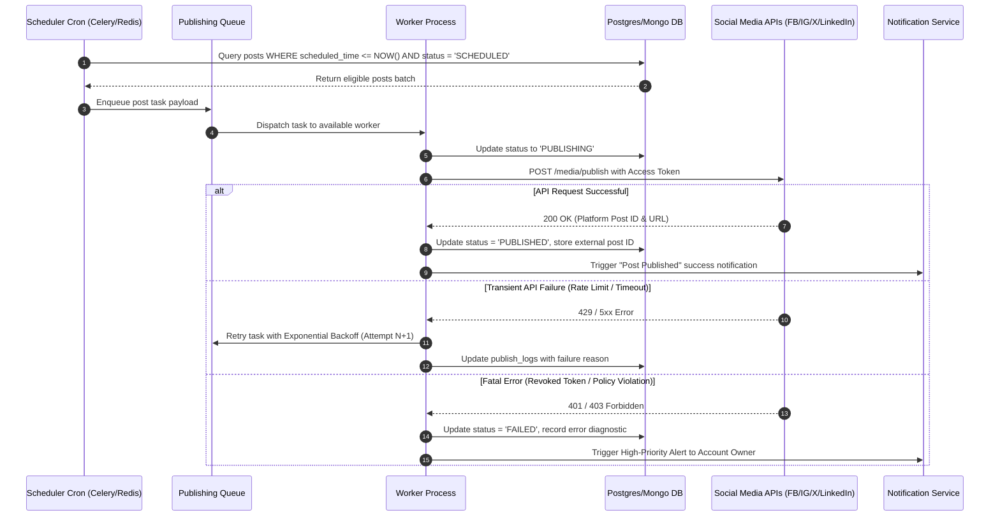
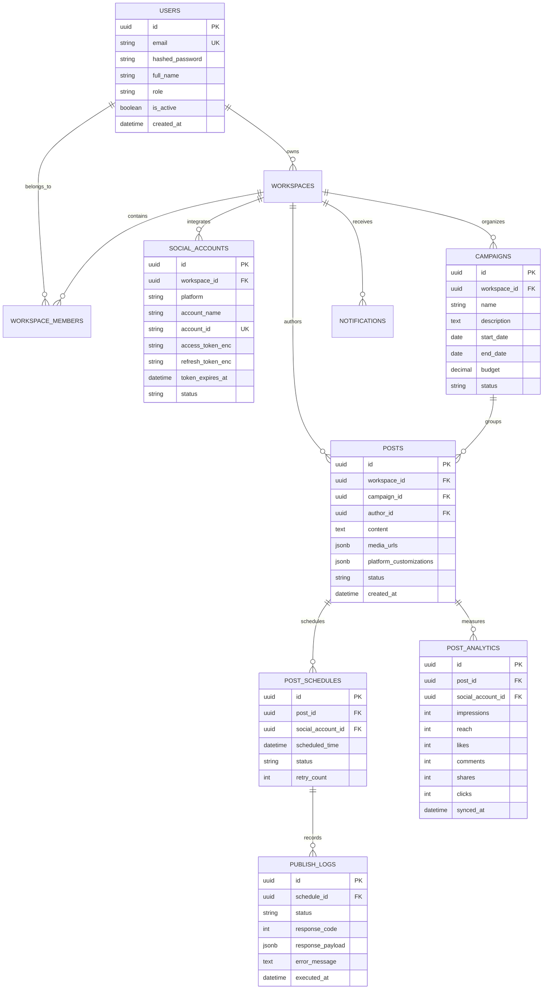

# SocialPilot: Social Media Scheduler & Campaign Management Platform
## Master Architecture, Design System & Functional Specification Document

---

### Executive Summary & Vision

**SocialPilot** is an enterprise-grade, centralized Social Media Scheduling, Campaign Orchestration, and Audience Analytics Platform. Engineered for digital marketing agencies, high-growth startups, enterprise marketing teams, and content creators, the platform streamlines the end-to-end lifecycle of multi-platform social media operations:
- **Ideation & Creation:** AI-assisted content composer with native platform previews (Facebook, Instagram, X/Twitter, LinkedIn, YouTube, Pinterest).
- **Scheduling & Orchestration:** Drag-and-drop calendar matrix, automated time-slot queues, and intelligent cadence optimization.
- **Publishing Engine:** Resilient, asynchronous worker pipeline with token management, rate-limit throttles, and automatic exponential backoff retry algorithms.
- **Analytics & BI:** Interactive data visualization dashboards providing real-time engagement telemetry, audience demographics, ROI attribution, and automated white-labeled PDF/Excel reporting.
- **Collaboration & Governance:** Role-Based Access Control (RBAC), multi-tier approval workflows, and audit-ready activity trails.

---

## 1. High-End UI/UX Design System & Aesthetic Architecture

To deliver an ultra-premium, modern SaaS experience, the frontend leverages a tailored design system engineered for visual immersion, zero visual clutter, and micro-delights.

```
+-----------------------------------------------------------------------------------+
|  THEME TOKENS: Deep Obsidian (#0B0F19) / Slate Card (#111827) / Cyan-Indigo Accent|
|  SURFACES: Backdrop Blur (20px), 1px Subtle Border (rgba(255,255,255,0.08))       |
|  TYPOGRAPHY: Plus Jakarta Sans / Inter / Fira Code (Data)                         |
|  INTERACTIONS: Framer Motion spring physics, hover scale (1.02), glowing badges   |
+-----------------------------------------------------------------------------------+
```

### 1.1 Color Palette & Token Hierarchy
- **Primary Canvas (Dark Mode):** `#090D16` (Deep Midnight Obsidian)
- **Secondary Surface / Cards:** `#111827` (Rich Carbon Slate) with `rgba(255, 255, 255, 0.05)` border stroke.
- **Elevated Modals / Popovers:** `#1E293B` with `backdrop-filter: blur(24px)` (Glassmorphism).
- **Brand Accent Gradient:** Linear gradient `135deg, #6366F1 (Indigo)` -> `#8B5CF6 (Purple)` -> `#EC4899 (Pink)`.
- **Platform Brand Accents:**
  - *Facebook:* `#1877F2` | *Instagram:* Gradient (`#833AB4` -> `#FD1D1D` -> `#F77737`)
  - *LinkedIn:* `#0A66C2` | *X (Twitter):* `#000000` / `#1D9BF0`
  - *YouTube:* `#FF0000` | *Pinterest:* `#E60023`
- **Functional Semantics:**
  - *Success (Published):* `#10B981` (Emerald)
  - *Warning (Pending Approval / Due Soon):* `#F59E0B` (Amber)
  - *Error (Failed Post / Disconnected Token):* `#EF4444` (Crimson)
  - *Info / Processing (In Queue):* `#3B82F6` (Electric Blue)

### 1.2 Typography & Iconography
- **Headings & Display:** `Plus Jakarta Sans`, Weights: 600 (SemiBold), 700 (Bold), 800 (ExtraBold).
- **Body & Data Grid:** `Inter`, Weights: 400 (Regular), 500 (Medium).
- **Metrics, Counters & Monospaced Codes:** `JetBrains Mono` / `Fira Code`.
- **Iconography:** Lucide Icons React with duotone accents and micro-hover glow effects.

### 1.3 Micro-Interactions & Motion Design
- **Card Hover:** Subtle dynamic radial gradient spotlight following mouse position (`cursor-spotlight`).
- **State Transitions:** Framer Motion spring physics (`stiffness: 300, damping: 25`) on tab switches and modal reveals.
- **Live Previews:** Instant real-time synchronized rendering of post cards as user types characters, uploads media, or attaches hashtags.
- **Skeleton States:** Shimmer animation masks for zero-layout-shift data loading.

---

## 2. System Architecture & Tech Stack



### 2.1 Technology Stack Matrix
| Layer | Technologies Used | Rationale |
| :--- | :--- | :--- |
| **Frontend Framework** | Next.js (App Router), React, Tailwind CSS | High rendering speed, SSR/CSR versatility, modular components. |
| **Visuals & Charts** | Recharts, Chart.js, Lucide-React, Framer Motion | High-performance interactive telemetry and responsive dashboards. |
| **Backend Engine** | Python 3.11+, FastAPI, Pydantic v2, Uvicorn | Async I/O throughput, automatic OpenAPI documentation, schema safety. |
| **Relational Database** | PostgreSQL + SQLAlchemy 2.0 ORM + Alembic | Strict relational integrity for Users, Teams, Schedules, Campaigns, RBAC. |
| **Document Database** | MongoDB (Motor / PyMongo) | Flexible schema for diverse platform API payloads, raw metrics, log trails. |
| **Cache & Task Queue**| Redis 7.x + Celery / Asynchronous Workers | High-throughput sub-millisecond locking, queueing, session management. |
| **Media Pipeline** | Cloudinary / AWS S3 + Pillow / FFmpeg | Image compression, aspect ratio auto-cropping, video thumbnail generation. |
| **Container & CI/CD** | Docker, Docker Compose, GitHub Actions | Isolated, reproducible multi-container deployment across staging/prod. |

---

## 3. Comprehensive Module-by-Module Functional Blueprint

---

### Module 1: User Management, Multi-Tenancy & RBAC

```
                   +------------------------+
                   |  Super Administrator   |
                   +-----------+------------+
                               |
         +---------------------+---------------------+
         |                                           |
+--------v---------+                       +---------v--------+
|  Business Admin  |                       |  Agency Account  |
+--------+---------+                       +---------+--------+
         |                                           |
    +----+-----------------------+              +----+-----------------------+
    |                            |              |                            |
+---v-------------+    +---------v----+    +----v------------+    +----------v---+
| Marketing Team  |    | Content      |    | Client Reviewer |    | External     |
| (Campaign/Analytics) | Creator      |    | (Approval Only) |    | Contributor  |
+-----------------+    +--------------+    +-----------------+    +--------------+
```

1. **Authentication & Session Security:**
   - JWT tokens with short TTL (15 mins) and automated sliding Refresh Tokens (7 days).
   - Multi-Factor Authentication (TOTP via Google Authenticator/Authy).
   - OAuth2 Single Sign-On (Google, GitHub, Microsoft Azure AD).
2. **Granular Role Hierarchy:**
   - **Administrator:** Global system settings, tenant billing, audit logs, user provisioning.
   - **Business User / Brand Manager:** Full access to all brand accounts, budget assignments, campaign approvals.
   - **Marketing Specialist:** Campaign creation, scheduling, analytics exploration, report generation.
   - **Content Creator / Copywriter:** Draft authoring, asset uploading, submitting posts for review.
   - **Client / Stakeholder (Guest):** Read-only calendar viewer with one-click post approval/rejection comments.
3. **Workspace Multi-Tenancy:**
   - Switch between multiple client workspaces with isolated accounts, assets, and billing without logging out.

---

### Module 2: Multi-Platform Social Account & Token Vault

1. **Seamless OAuth 2.0 Integration Workflows:**
   - Integrated connectors for:
     - **Facebook:** Pages, Groups, Business Accounts.
     - **Instagram:** Creator & Business Accounts (Stories, Feed, Reels).
     - **LinkedIn:** Personal Profiles & Company Brand Pages.
     - **X (Twitter):** Individual feeds, Thread publishing.
     - **YouTube:** Shorts, Video uploads, Community tab updates.
     - **Pinterest:** Boards, Idea Pins, Rich Pins.
2. **Token Lifecycle & Vault Security:**
   - Industry-standard AES-256 encrypted storage of Access Tokens and Refresh Tokens.
   - Proactive Token Health Monitor: Real-time status badges (*Connected, Expiring in X days, Revoked, Needs Re-auth*).
   - Automated background token refresh workers avoiding disconnect interruptions.
3. **Multi-Account Profile Switcher:**
   - Group accounts by Client, Brand, or Region (e.g., "Nike - US", "Nike - EMEA").

---

### Module 3: Content Studio, Omnichannel Composer & Scheduling Engine

```
+-----------------------------------------------------------------------------------+
| COMPOSER STUDIO                                                                   |
| [Select Channels: [x] FB  [x] IG  [x] LinkedIn  [x] X  [x] YT]                    |
| +-----------------------------------------+ +-----------------------------------+ |
| | Master Caption                          | | Live Interactive Preview (Tabs)   | |
| | "Launching our new summer line! 🚀🔥   | | [Instagram Feed View]             | |
| | #SummerVibes #Style"                   | | +-------------------------------+ | |
| |                                         | | | @BrandOfficial      ...       | | |
| | [ AI Rephrase ] [ Auto-Hashtags ]       | | | [    Image / Video Asset    ] | | |
| | [ Media Upload / Drag & Drop ]          | | |                               | | |
| | [ Platform Customization Override ]     | | | ❤️ 1,420 likes                | | |
| +-----------------------------------------+ | +-------------------------------+ | |
| [ Draft ] [ Submit for Approval ] [ Add to Queue ] [ Schedule: Aug 24, 10:00 AM ] |
+-----------------------------------------------------------------------------------+
```

1. **Unified Omnichannel Composer:**
   - Write once, tailor per platform (e.g., set a 280-character limit for X while keeping rich long-form copy for LinkedIn).
   - Built-in AI Assistant: Content ideation, tone adjustment (Professional, Casual, Punchy), hashtag recommendations, and translation.
   - Character counter, emoji picker, URL shortener with automated UTM campaign tag injection (`utm_source`, `utm_medium`, `utm_campaign`).
2. **Multi-Format Media Engine:**
   - Support for Text, Single Image, Multi-Image Carousels, Short-form Videos (Reels, TikToks, Shorts), and Documents (PDF carousels for LinkedIn).
   - In-app image cropper with pre-set aspect ratios (1:1 Square, 4:5 Portrait, 16:9 Landscape, 9:16 Vertical).
3. **Advanced Scheduling Matrix:**
   - **Specific Date & Time:** Precision scheduling down to the minute.
   - **Queue Slots (Posting Cadence):** Define weekly recurring slots (e.g., Mon/Wed/Fri at 09:00 AM) and auto-fill the queue.
   - **Recurrent Scheduling:** Auto-repost evergreen content weekly, monthly, or quarterly.
   - **Interactive Drag-and-Drop Calendar:** Monthly, weekly, and daily grid views. Reschedule posts simply by dragging cards across days.

---

### Module 4: Campaign Management & Omnichannel Orchestration

1. **Strategic Campaign Creation:**
   - Assign Campaign Name, Objectives (Brand Awareness, Lead Generation, Product Launch, Holiday Sale), Start/End Dates, and Allocated Budget.
   - Tag and associate multiple cross-platform posts to a single parent campaign.
2. **Real-time Campaign Progress Tracking:**
   - Dynamic progress bars indicating scheduled vs. published vs. failed content items.
   - Aggregated cross-platform budget burn rate vs. engagement ROI metrics (Cost Per Click, Cost Per Engagement).
3. **Campaign Comparison Matrix:**
   - Side-by-side performance benchmarking across past and active campaigns.

---

### Module 5: Resilient Multi-Platform Publishing Engine



1. **High-Concurrency Worker Architecture:**
   - Asynchronous dispatcher capable of publishing thousands of concurrent posts without UI blocking.
   - Per-platform rate limiter token buckets complying with Meta, X, and LinkedIn API limits.
2. **Fault Tolerance & Exponential Backoff:**
   - 3-tier automatic retry strategy with jitter for transient 500/502/503/429 network errors.
3. **Comprehensive Publishing Audit Log:**
   - Granular timestamped execution records capturing HTTP request payloads, response codes, error traces, and live published URLs.

---

### Module 6: Enterprise Analytics, BI & Audience Intelligence

```
+-----------------------------------------------------------------------------------+
| ANALYTICS OVERVIEW               [ Last 30 Days v ] [ All Platforms v ] [ Export ]|
| +-----------------+ +-----------------+ +-----------------+ +-------------------+ |
| | Total Reach     | | Impressions     | | Avg Engagement  | | Follower Growth   | |
| | 1.84M (+14.2%)  | | 4.29M (+22.8%)  | | 6.84% (+1.4%)   | | +28,450 (+8.6%)   | |
| +-----------------+ +-----------------+ +-----------------+ +-------------------+ |
|                                                                                   |
| [ Engagement Trends (Line Chart) ]         [ Audience Demographics (Donut) ]      |
|                                                                                   |
| [ Best Time to Post Heatmap (24h x 7d) ]   [ Top Performing Posts (Leaderboard) ] |
+-----------------------------------------------------------------------------------+
```

1. **Omnichannel Engagement Metrics:**
   - Aggregated & Platform-specific telemetry: Impressions, Reach, Likes, Comments, Shares, Retweets, Video Views, Link Clicks, Saves.
2. **Audience Demographics & Intelligence:**
   - Age-Gender distribution, top geographic countries/cities, active language breakdown, and net follower gain/loss trajectory.
3. **AI Best-Time-To-Post Heatmap:**
   - Algorithmic analysis of historical engagement patterns rendering a 24-hour × 7-day interactive heatmap highlighting optimal posting windows.
4. **Competitor & Content Category Benchmarks:**
   - Categorize content (e.g., #Educational, #Promo, #BehindTheScenes) to determine which themes yield peak engagement.

---

### Module 7: Real-Time Notification & Team Collaboration Hub

1. **Multi-Channel Notification Dispatcher:**
   - **In-App Notification Center:** Real-time bell dropdown with unread badges, filterable by *Publishing, Approvals, System, Mentions*.
   - **WebSockets / Server-Sent Events (SSE):** Instantaneous notification delivery without page refresh.
   - **Email Notifications:** Rich HTML transactional emails for scheduled post reminders, failed post alerts, and weekly summary digests.
   - **Push Notifications:** Web Push via Service Workers for critical publishing alerts.
2. **Team Collaboration & Approval Workflow:**
   - Post Review lifecycle: `Draft` -> `Submitted for Review` -> `Changes Requested` -> `Approved & Scheduled`.
   - In-line commenting and mention tagging (`@jane`) right inside the post creation panel.

---

### Module 8: Advanced Reporting & Export Engine

1. **Custom Report Builder:**
   - Generate white-labeled, executive-ready reports with custom branding/logos.
   - Cross-platform comparison reports, campaign-specific ROI audits, and channel-by-channel breakdowns.
2. **Multi-Format Exporting:**
   - **PDF:** High-resolution vector-rendered PDF reports with embedded charts, KPI summary tables, and top posts.
   - **Excel / CSV:** Raw tabular data exports for data science or external BI tool imports (Power BI / Tableau).
3. **Automated Scheduled Email Reports:**
   - Configure automated delivery (e.g., "Send Monthly Executive Report to client@domain.com on 1st of every month at 08:00 AM").

---

### Module 9: System Admin Console & Health Monitoring

1. **System Health & Queue Telemetry:**
   - Real-time CPU/Memory usage, active Celery/Background workers count, queue depth, API latency percentiles (p95, p99).
2. **User Management & Tenant Provisioning:**
   - Search, ban, elevate, or impersonate users for troubleshooting.
3. **Global Audit Trail:**
   - Immutable security log tracking all logins, permission changes, token integrations, and post deletions.

---

## 4. Database Architecture & Schema Design



---

## 5. End-to-End Implementation Roadmap (Milestones 1 to 4)

| Milestone & Timeline | Core Focus | Deliverables & Outcomes |
| :--- | :--- | :--- |
| **Milestone 1**<br>*(Weeks 1 & 2)* | **Foundation, Auth & Account Integration** | - PostgreSQL & MongoDB schema migrations.<br>- FastAPI JWT Auth, RBAC & user profile management.<br>- OAuth2 flows for Facebook, Instagram, LinkedIn, X.<br>- Next.js responsive app shell with Dark Theme & Design Tokens. |
| **Milestone 2**<br>*(Weeks 3 & 4)* | **Content Studio, Scheduling & Publishing Engine** | - Omnichannel Post Composer with dynamic live preview.<br>- Drag-and-drop Publishing Calendar & Recurring Queue.<br>- Redis background worker queue with rate-limit throttles & exponential backoff.<br>- Publishing audit logs and failed post retry workflows. |
| **Milestone 3**<br>*(Weeks 5 & 6)* | **Campaigns, BI Analytics & Notification Hub** | - Strategic Campaign Manager with goal/budget tracking.<br>- Interactive Analytics Dashboards (Recharts/Chart.js).<br>- Heatmap for "Best Time to Post" & audience demographics.<br>- Real-time In-App WebSockets/SSE notifications & Email dispatcher. |
| **Milestone 4**<br>*(Weeks 7 & 8)* | **Reporting, Admin Console, Testing & Cloud DevOps** | - PDF & Excel report export engine with scheduled delivery.<br>- Admin System Health Console & audit logs.<br>- End-to-End integration testing & API resilience validation.<br>- Docker Compose containerization & AWS/Azure deployment scripts. |

---

## 6. Enterprise Non-Functional Requirements (NFRs)

1. **Performance & Scalability:**
   - API p95 response time `< 120ms` for core database operations.
   - Capable of scheduling & dispatching `100,000+` automated social posts per hour across distributed workers.
2. **Security & Data Privacy:**
   - End-to-end token encryption (AES-256 GCM) with rotating encryption keys.
   - Strict rate-limiting (`SlowAPI` on FastAPI) preventing brute-force attacks and abuse.
   - OWASP Top 10 compliance (XSS sanitization, CSRF tokens, SQL Injection prevention via ORM).
3. **High Availability & Resilience:**
   - 99.9% uptime architecture with worker isolation ensuring single-platform API outages do not affect remaining publishing pipelines.

---

## 7. Master Real-Time Applications & API Integration Ticklist

- [x] **Omnichannel Post Composer & Studio:** Multi-channel authoring, character meters, live interactive previews across 6 platforms (Facebook, Instagram, X/Twitter, LinkedIn, YouTube, Pinterest).
- [x] **Real-Time Free AI Content Generator:** Live text rephrasing, tone optimization, and hashtag generation via Pollinations AI API.
- [x] **Free AI Graphic Generator & Visual Studio:** Direct high-res social media image generation (1:1, 16:9, 4:5, 9:16) via Pollinations Image API.
- [x] **Live Trending News & Ideas Feed:** Real-time HTTP integrations fetching top news stories from HackerNews API & viral quotes engine.
- [x] **Real-Time WebSockets Telemetry Gateway:** Socket feed (`/ws/telemetry` & `/ws/notifications`) broadcasting CPU, RAM, active worker stats, and system alerts.
- [x] **Asynchronous Publishing & Dispatch Engine:** Background worker architecture with token vault encryption, retry exponential backoff, and Graph API dispatches.
- [x] **Interactive Drag-and-Drop Calendar Matrix:** Visual calendar planner with interactive drag-to-reschedule functionality.
- [x] **Strategic Campaign Orchestration & ROI:** Campaign budget tracking, progress bars, and cross-channel attribution.
- [x] **BI Analytics & Heatmap Telemetry:** Recharts engagement visualizers, 24x7 best-time-to-post heatmap, and audience demographics.
- [x] **Admin Governance & Diagnostic Audit Console:** Interactive Real-Time Integration Hub (`/admin/integrations`), system health monitoring, and immutable security audit log trails.
