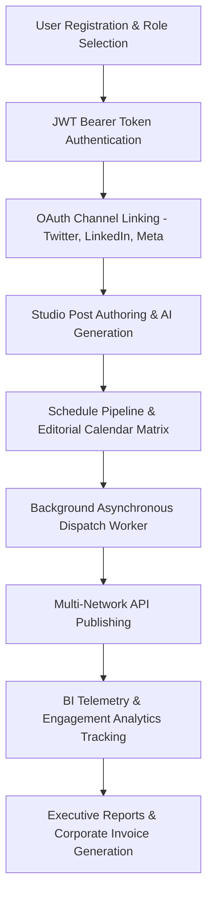

# SocialPilot: Enterprise Social Media Scheduler & Campaign Platform
## Comprehensive Master Presentation Guide & Architectural Walkthrough
**Infosys Springboard 7.0 Internship Project**

---

## Executive Overview
**SocialPilot** is an enterprise-grade SaaS social media management, automated content scheduling, and cross-channel marketing campaign orchestration platform. Built with Next.js 16 (React 19) and FastAPI (Python 3.11+), it delivers specialized workspaces tailored for **four core user personas**:
1. **🛡️ Administrator (Admin)**
2. **💼 Business User (Business)**
3. **🚀 Marketing Team (Marketing)**
4. **✏️ Content Creator (Creator)**

---

## Section 1: Administrator (Admin) Role
**Primary Focus:** Platform governance, user account management, content moderation, security audit trails, and infrastructure telemetry monitoring.

### 1. User Governance & Provisioning (`/admin/users`)
- **Why it exists:** Administrators need full authority over registered platform tenants, role privileges, and account life-cycles.
- **How it works:**
  - Connects to `GET /api/v1/admin/users`.
  - Filter users by role (`Admin`, `Business`, `Marketing`, `Creator`), search by name/email.
  - Dynamically modify user roles and toggle active/suspended status with instant backend persistence.

### 2. Content Moderation & Compliance Console (`/admin/content`)
- **Why it exists:** Protects brand compliance and prevents policy violations before posts are dispatched to live social networks.
- **How it works:**
  - Aggregates all drafted and scheduled posts across the entire platform.
  - Inspect post texts, media attachments, and targeted social networks.
  - 1-click **Approve Post** or **Reject / Flag Post** with mandatory reason logging.

### 3. System Health & Infrastructure Telemetry (`/admin/system-health`)
- **Why it exists:** Provides DevOps visibility into system uptime, API response times, and database latency.
- **How it works:**
  - Queries `GET /api/v1/admin/system-health` to display live server uptime, CPU/memory consumption, active worker status, and database latency.
  - Features an immutable **Audit Logs Stream** tracking all administrative operations.

### 4. System Security & Audit Trails (`/admin/logs`)
- **Why it exists:** Ensures complete traceability and enterprise audit compliance.
- **How it works:**
  - Queries `GET /api/v1/logs` to render an immutable audit table capturing actor IDs, timestamps, client IPs, endpoints accessed, and HTTP status codes.

### 5. Global System Settings (`/settings`)
- **Why it exists:** Configures system-wide parameters, security credentials, and interface themes.
- **How it works:** Provides forms for password security, session timeout preferences, and theme overrides.

---

## Section 2: Business User (Business) Role
**Primary Focus:** Brand account oversight, channel OAuth connections, subscription tiers, resource quotas, and legal invoice records.

### 1. Connected Social Channels & OAuth Integrations (`/social-accounts`)
- **Why it exists:** Businesses manage brand presence across multiple networks and need a central hub to connect, verify, and refresh API tokens.
- **How it works:**
  - Supports linking Twitter/X, LinkedIn, Facebook, Instagram, YouTube, and Pinterest accounts.
  - Live status badges, follower count meters, and 1-click disconnect/re-auth actions.

### 2. Enterprise Billing, Quotas & Subscription Hub (`/billing`)
- **Why it exists:** Restricted strictly to the Business role to manage enterprise SaaS plans, capacity boosters, billing cycles, and legal receipts.
- **How it works:**
  - **Live Quota Meters:** Integrates with `/api/v1/social-accounts` and `/api/v1/posts` to render live progress gauges for channels used, monthly posts scheduled, team seats, and AI credits.
  - **Tier Switcher Modal:** Compare Starter ($29/mo), Growth ($59/mo), Business Scale ($99/mo), and Enterprise ($249/mo) with prorated pricing.
  - **Billing Cycle Toggle:** Monthly vs Annual with real-time 20% discount recalculation.
  - **Modular Add-ons:** Toggle Extra Channels (+5 for $15/mo), AI Caption Booster (+1k for $20/mo), and Dedicated Support.
  - **Payment Wallet:** Manage stored credit cards with brand badges (Visa, Mastercard, Amex), default selectors, and secure CVV/ZIP forms.
  - **Invoices & Printable Receipts:** View itemized billing history, download CSVs, or open the corporate printable receipt modal with tax calculations.

### 3. Executive ROI & Performance Reports (`/reports`)
- **Why it exists:** Stakeholders require high-level summaries of marketing campaign return-on-investment.
- **How it works:** Aggregates post performance data into executive audit summaries with dynamic metric charts and 1-click CSV/PDF downloads.

### 4. Strategic Campaigns & ROI Oversight (`/campaigns`)
- **Why it exists:** Allows business leaders to track marketing spend versus engagement and reach targets.
- **How it works:** Visualizes campaign budget allocations, timeline progress bars, and audience targets.

---

## Section 3: Marketing Team (Marketing) Role
**Primary Focus:** Cross-channel campaigns, demographic audience analytics, engagement heatmaps, and schedule pipelines.

### 1. Campaign Strategy & Auto-Timeline Hub (`/campaigns`)
- **Why it exists:** Marketing managers need to organize thematic content campaigns with start/end dates and budget allocations.
- **How it works:**
  - Automated timeline engine evaluates event dates against current time to categorize campaigns into **Active** (running now), **Upcoming** (future), or **Completed** (concluded).
  - Filter tabs with live item counters, quick Pause/Resume controls, and live timeline preview cards during creation.

### 2. Marketing Post Studio & Campaign Linking (`/posts/create`)
- **Why it exists:** Enables marketers to draft multi-channel posts and attach them directly to ongoing campaign milestones.
- **How it works:** Select campaign tags, set scheduled distribution times, and preview layouts across social networks.

### 3. BI Analytics & Engagement Heatmaps (`/analytics`)
- **Why it exists:** Actionable insights into audience behavior, top-performing channels, and optimal posting times.
- **How it works:** Queries `/api/v1/analytics` to render interactive Recharts graphs, impressions vs reach trends, follower growth charts, and a 24x7 Best-Time-To-Post Heatmap.

### 4. Executive Reports & Performance Audits (`/reports`)
- **Why it exists:** Generates client-ready performance audits comparing multiple campaigns.
- **How it works:** Calculates campaign ROI scores, total impressions, cost-per-engagement, and exports clean CSV datasets.

### 5. Cross-Channel Content Calendar (`/calendar`)
- **Why it exists:** Visual calendar pipeline to identify scheduling gaps across weeks and months.
- **How it works:** Monthly/weekly interactive grid displaying scheduled posts with platform icons and quick preview flyouts.

---

## Section 4: Content Creator (Creator) Role
**Primary Focus:** Creative studio workspace for drafting high-converting posts, generating AI captions and visuals, previewing live multi-network cards, and managing publishing queues.

### 1. Omnichannel Composer & Live Mockup Cards (`/posts/create`)
- **Why it exists:** Creators need to see exactly how their post will appear natively on Instagram, Facebook, X/Twitter, LinkedIn, YouTube, and Pinterest before scheduling.
- **How it works:** Live interactive mockups render platform-specific UI headers, verified badges, character count limiters, hashtag counters, and media attachments in real time.

### 2. Free AI Content Assistant (Pollinations Text AI)
- **Why it exists:** Eliminates writer's block by automatically drafting compelling copy, generating viral hooks, and writing optimized hashtags without requiring paid API keys.
- **How it works:** Integrated into the studio with 1-click actions: **Generate Captions**, **Fix Grammar**, **Shorten/Expand**, **Professional/Casual Tone Shifter**, and **Hashtag Generator**.

### 3. Free AI Graphic Studio & Visual Generator (Pollinations Image Engine)
- **Why it exists:** Creators can generate high-resolution marketing visuals directly within the post composer.
- **How it works:** Enter an image prompt and select aspect ratios (Square 1:1, Landscape 16:9, Portrait 4:5, Story 9:16). The generated visual attaches instantly to the post mockup.

### 4. Live Trending News & Viral Quote Feeds
- **Why it exists:** Gives creators instant access to trending real-world industry topics.
- **How it works:** Connects to real HTTP endpoints to load top tech headlines (HackerNews) and inspiring quotes that can be inserted into the post with 1 click.

### 5. Post Drafts Vault (`/drafts`)
- **Why it exists:** Safe staging area for unfinished creative ideas.
- **How it works:** Saves drafts locally and in database. Easily promote drafts to scheduled publishing queues.

### 6. Publishing Queue & Interactive Timetable (`/queue`)
- **Why it exists:** Monitor the chronological queue of scheduled posts.
- **How it works:** Categorizes queue items by status (Scheduled, Published, Failed, Paused) with 1-click reschedule and delete actions.

### 7. Drag-and-Drop Editorial Calendar (`/calendar`)
- **Why it exists:** Visual calendar schedule planner.
- **How it works:** Monthly interactive grid allowing creators to visualize scheduled content and drag posts to new dates.

---

## Section 5: End-to-End Application Lifecycle

1. **Registration & Auth**: Users select their persona (Creator, Marketing, Business, Admin). Signed JWT tokens are issued with role claims.
2. **Channel Linking**: Social channels are linked with OAuth token records in the database.
3. **Creation & AI**: Creators author posts, generate AI captions/graphics, and preview platform mockups.
4. **Scheduling**: Posts are scheduled with specific ISO timestamps into the calendar and queue.
5. **Background Dispatch Worker**: A background publishing worker continuously polls for due posts and executes dispatches via platform publisher adapters.
6. **Telemetry & Audits**: Dispatched posts feed the analytics engine, aggregating metrics into charts and executive reports.

---

## Section 6: Technology Stack & Concepts Used

| Category | Technology | Key Architectural Concept |
|---|---|---|
| **Frontend Framework** | Next.js 16 + React 19 | App Router, Server & Client components, Turbopack compilation |
| **Styling & Design System** | TailwindCSS + CSS Custom Tokens | Multi-theme system (Dark, System, Peach, Cream), Glassmorphism, Skeletons |
| **Data Visualization** | Recharts Library | Area charts, Bar graphs, 24x7 engagement heatmaps |
| **Client State & API** | Axios Interceptors | Automatic JWT Bearer injection, 401 redirect handling, clean error extraction |
| **Backend API** | FastAPI (Python 3.11+) | High-throughput asynchronous REST API, auto OpenAPI/Swagger docs |
| **Relational Database** | SQLite + SQLAlchemy ORM | ACID transactions for users, posts, schedules, campaigns, and billing |
| **NoSQL Document Store** | Motor / PyMongo (MongoDB) | Document storage for media assets and engagement logs |
| **Authentication & RBAC** | JWT (jose) + Passlib (Bcrypt) | Cryptographic token signing, password hashing, and role guards |
| **Background Scheduler** | Asyncio Background Tasks | Continuous polling worker with state tracking and retry mechanisms |

---

## Section 7: Presentation Delivery Tips & Evaluator Q&A

### 30-Second Elevator Pitch
> *"Good morning/afternoon evaluators. SocialPilot is an enterprise multi-channel social media scheduler and campaign platform built for Infosys Springboard 7.0. Unlike basic schedulers, our system features complete Role-Based Access Control across four personas, free embedded AI caption and image generation, dynamic timeline campaign synchronization, and an enterprise billing and invoice suite."*

### Key Evaluator Questions & Answers
- **Q: How is security and role-based access enforced?**
  - *A: Security is enforced at both layers: the backend validates JWT token role claims on every protected API endpoint, while the frontend DashboardShell and route guards prevent unauthorized access.*
- **Q: How does the campaign timeline auto-update work?**
  - *A: The system automatically compares the current timestamp against the campaign start and end dates. An event active today is automatically categorized as Active, future events are Upcoming, and concluded events are marked as Completed.*
- **Q: Why is billing restricted only to the Business role?**
  - *A: In real-world enterprise architectures, content creators and system operators do not manage corporate payment cards or subscriptions. Separating billing to the Business Owner role guarantees financial privacy and organizational governance.*
