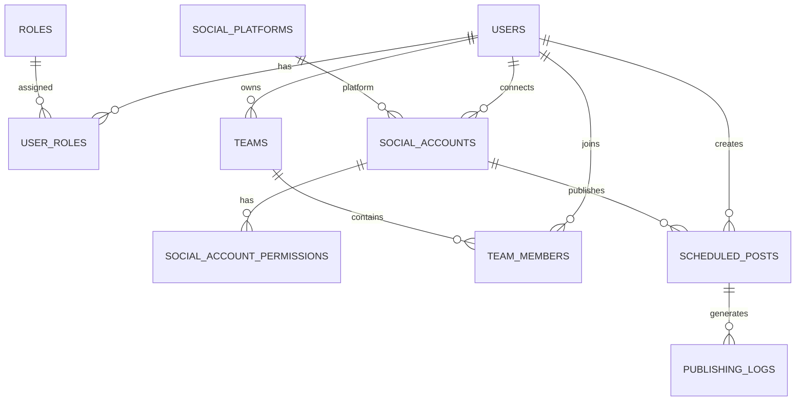

# SocialPilot Database Schema

# Database Architecture

SocialPilot uses two databases:

- **PostgreSQL** — Stores structured relational data such as users, roles, teams, social accounts, scheduled posts, and publishing logs.
- **MongoDB** — Stores flexible content and media metadata.

---

# PostgreSQL Tables

## users

Stores registered users.

- id — Primary Key
- name
- email — Unique
- password_hash
- bio
- is_active
- created_at
- updated_at

---

## roles

Stores RBAC (Role-Based Access Control) roles.

- id — Primary Key
- name — Unique

Default Roles:

- Content Creator
- Marketing Team
- Business User
- Administrator

---

## user_roles

Maps users to roles.

- user_id — Foreign Key → users.id
- role_id — Foreign Key → roles.id

Primary Key:

(user_id, role_id)

---

## social_platforms

Stores supported social media platforms.

- id — Primary Key
- name — Unique

Platforms include:

- Facebook
- Instagram
- LinkedIn
- X (Twitter)
- YouTube
- Pinterest

---

## social_accounts

Stores social media accounts connected by users.

- id — Primary Key
- user_id — Foreign Key → users.id
- platform_id — Foreign Key → social_platforms.id
- platform_user_id
- username
- access_token
- refresh_token
- token_expires_at
- is_active
- last_synced_at
- created_at
- updated_at

Unique:

(platform_id, platform_user_id)

---

## social_account_permissions

Stores permissions granted to connected social accounts.

- id — Primary Key
- social_account_id — Foreign Key → social_accounts.id
- permission_name
- is_granted
- created_at

Unique:

(social_account_id, permission_name)

---

## teams

Stores teams.

- id — Primary Key
- name
- owner_id — Foreign Key → users.id
- created_at

---

## team_members

Maps users to teams.

- team_id — Foreign Key → teams.id
- user_id — Foreign Key → users.id
- joined_at

Primary Key:

(team_id, user_id)

---

# Milestone 2 – Content Scheduling & Publishing

## scheduled_posts

Stores posts created by users that are scheduled for future publishing.

- id — Primary Key
- user_id — Foreign Key → users.id
- social_account_id — Foreign Key → social_accounts.id
- title
- content
- scheduled_time
- status (Draft / Scheduled / Published / Failed)
- is_recurring
- recurrence_pattern
- created_at
- updated_at

Relationship:

- One user can create many scheduled posts.
- One social account can have many scheduled posts.

---

## publishing_logs

Stores the publishing history of scheduled posts.

- id — Primary Key
- scheduled_post_id — Foreign Key → scheduled_posts.id
- published_at
- status (Success / Failed)
- platform_response
- error_message
- created_at

Relationship:

- One scheduled post can have multiple publishing log entries.

---

# Entity Relationship Diagram



---

# MongoDB

Database:

```
socialpilot_db
```

## content_metadata

Stores flexible metadata associated with social media content.

Example Fields:

- user_id
- title
- content_type
- platforms
- status
- tags
- created_at

---

## media_metadata

Stores metadata for media associated with content.

Example Fields:

- user_id
- file_name
- media_type
- file_size
- storage_url
- created_at