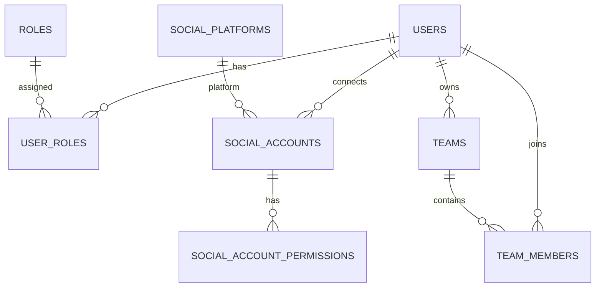

# SocialPilot Database Schema

## Database Architecture

SocialPilot uses two databases:

- PostgreSQL — structured relational data such as users, roles, teams, and social accounts.
- MongoDB — flexible content and media metadata.

---

## PostgreSQL Tables

### users
Stores registered users.

- id — Primary Key
- name
- email — Unique
- password_hash
- bio
- is_active
- created_at
- updated_at

### roles
Stores RBAC roles.

- id — Primary Key
- name — Unique

Default roles:

- Content Creator
- Marketing Team
- Business User
- Administrator

### user_roles
Maps users to roles.

- user_id — Foreign Key → users.id
- role_id — Foreign Key → roles.id

Primary Key: (user_id, role_id)

### social_platforms
Stores supported social platforms.

- id — Primary Key
- name — Unique

Platforms include Facebook, Instagram, LinkedIn, X, YouTube, and Pinterest.

### social_accounts
Stores social accounts connected by users.

- id — Primary Key
- user_id — Foreign Key → users.id
- platform_id — Foreign Key → social_platforms.id
- platform_user_id
- username
- access_token
- refresh_token
- token_expires_at
- is_active
- last_synced_at
- created_at
- updated_at

Unique: (platform_id, platform_user_id)

### social_account_permissions
Stores permissions granted to connected social accounts.

- id — Primary Key
- social_account_id — Foreign Key → social_accounts.id
- permission_name
- is_granted
- created_at

Unique: (social_account_id, permission_name)

### teams
Stores teams.

- id — Primary Key
- name
- owner_id — Foreign Key → users.id
- created_at

### team_members
Maps users to teams.

- team_id — Foreign Key → teams.id
- user_id — Foreign Key → users.id
- joined_at

Primary Key: (team_id, user_id)
## Entity Relationship Diagram

---

## MongoDB

Database: socialpilot_db

### content_metadata

Stores flexible metadata associated with social-media content.

Example fields:

- user_id
- title
- content_type
- platforms
- status
- tags
- created_at

### media_metadata

Stores metadata for media associated with content.

Example fields:

- user_id
- file_name
- media_type
- file_size
- storage_url
- created_at