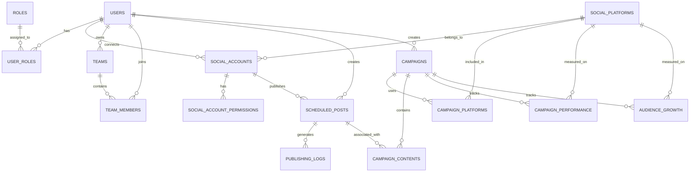

# SocialPilot Database Schema

## Overview

The SocialPilot database supports the complete social media management workflow from user management and social account management to content scheduling, publishing, campaign management, analytics, and database query optimization.

The system uses two databases:

- PostgreSQL — Stores structured relational application data.
- MongoDB — Stores flexible content and media metadata.

### Technologies Used

- PostgreSQL
- MongoDB
- SQLAlchemy
- Alembic
- PyMongo

---

# Database Architecture

## PostgreSQL

PostgreSQL stores structured relational application data including:

- Users
- Roles
- User-role mappings
- Social platforms
- Social accounts
- Social account permissions
- Teams
- Team members
- Scheduled posts
- Publishing logs
- Campaigns
- Campaign-platform mappings
- Campaign-content mappings
- Campaign performance
- Audience growth

Database name:

```
socialpilot_db
```

## MongoDB

MongoDB stores flexible content and media metadata.

Database name:

```
socialpilot_db
```

Collections:

```
content_metadata
media_metadata
```

---

# Milestone 1 – User, Role, Social Account and Team Management

## users

Stores registered users.

Fields:

- id — Primary Key
- name
- email — Unique
- password_hash
- bio
- is_active
- created_at
- updated_at

## roles

Stores roles used for Role-Based Access Control (RBAC).

Fields:

- id — Primary Key
- name — Unique

Default Roles:

- Content Creator
- Marketing Team
- Business User
- Administrator

## user_roles

Maps users to their assigned roles.

Fields:

- user_id — Foreign Key → users.id
- role_id — Foreign Key → roles.id

Primary Key:

```
(user_id, role_id)
```

Relationship:

- One user can have multiple roles.
- One role can be assigned to multiple users.

## social_platforms

Stores supported social media platforms.

Fields:

- id — Primary Key
- name — Unique

Supported platforms:

- Facebook
- Instagram
- LinkedIn
- X (Twitter)
- YouTube
- Pinterest

## social_accounts

Stores social media accounts connected by users.

Fields:

- id — Primary Key
- user_id — Foreign Key → users.id
- platform_id — Foreign Key → social_platforms.id
- platform_user_id
- username
- access_token
- refresh_token
- token_expires_at
- is_active
- last_synced_at
- created_at
- updated_at

Unique:

```
(platform_id, platform_user_id)
```

Relationship:

- One user can connect multiple social accounts.
- One social platform can have multiple connected accounts.

## social_account_permissions

Stores permissions granted to connected social accounts.

Fields:

- id — Primary Key
- social_account_id — Foreign Key → social_accounts.id
- permission_name
- is_granted
- created_at

Unique:

```
(social_account_id, permission_name)
```

Relationship:

- One social account can have multiple permissions.

## teams

Stores teams.

Fields:

- id — Primary Key
- name
- owner_id — Foreign Key → users.id
- created_at

Relationship:

- One user can own multiple teams.
- Each team has one owner.

## team_members

Maps users to teams.

Fields:

- team_id — Foreign Key → teams.id
- user_id — Foreign Key → users.id
- joined_at

Primary Key:

```
(team_id, user_id)
```

Relationship:

- One team can contain multiple users.
- One user can belong to multiple teams.

---

# Milestone 2 – Content Scheduling and Publishing

## scheduled_posts

Stores posts created by users that are scheduled for future publishing.

Fields:

- id — Primary Key
- user_id — Foreign Key → users.id
- social_account_id — Foreign Key → social_accounts.id
- title
- content
- scheduled_time
- status
- is_recurring
- recurrence_pattern
- created_at
- updated_at

Status values:

```
Draft
Scheduled
Published
Failed
```

Relationship:

- One user can create many scheduled posts.
- One social account can have many scheduled posts.

## publishing_logs

Stores the publishing history of scheduled posts.

Fields:

- id — Primary Key
- scheduled_post_id — Foreign Key → scheduled_posts.id
- published_at
- status
- platform_response
- error_message
- created_at

Status values:

```
Success
Failed
```

Relationship:

- One scheduled post can have multiple publishing log entries.

---

# Milestone 3 – Campaign Management and Analytics

Milestone 3 extends the SocialPilot database with campaign management, campaign content tracking, engagement analytics, audience growth tracking, performance metrics, and ROI analysis.

The following tables were added:

- campaigns
- campaign_platforms
- campaign_contents
- campaign_performance
- audience_growth

## campaigns

Stores campaign information.

Fields:

- id — Primary Key
- user_id — Foreign Key → users.id
- name
- start_date
- end_date
- budget
- goal
- status
- created_at
- updated_at

Relationship:

- One user can create multiple campaigns.
- Each campaign belongs to a user.

## campaign_platforms

Maps campaigns to social media platforms.

Fields:

- id — Primary Key
- campaign_id — Foreign Key → campaigns.id
- platform_id — Foreign Key → social_platforms.id

Unique:

```
(campaign_id, platform_id)
```

Relationship:

- One campaign can use multiple social media platforms.
- One social platform can be used by multiple campaigns.

This table provides the mapping between campaigns and social platforms.

## campaign_contents

Maps campaigns to scheduled posts.

Fields:

- id — Primary Key
- campaign_id — Foreign Key → campaigns.id
- scheduled_post_id — Foreign Key → scheduled_posts.id
- created_at

Unique:

```
(campaign_id, scheduled_post_id)
```

Relationship:

- One campaign can contain multiple scheduled posts.
- Scheduled posts from Milestone 2 can be associated with campaigns.

This connects content scheduling with campaign management.

## campaign_performance

Stores campaign performance and engagement metrics.

Fields:

- id — Primary Key
- campaign_id — Foreign Key → campaigns.id
- platform_id — Foreign Key → social_platforms.id
- spend
- impressions
- reach
- likes
- comments
- shares
- conversions
- roi
- recorded_at

Metrics include:

- Spend
- Impressions
- Reach
- Likes
- Comments
- Shares
- Conversions
- ROI

Relationship:

- One campaign can have multiple performance records.
- Performance can be tracked for different social platforms.

## audience_growth

Stores audience and follower growth information.

Fields:

- id — Primary Key
- campaign_id — Foreign Key → campaigns.id
- platform_id — Foreign Key → social_platforms.id
- followers
- recorded_at

Relationship:

- One campaign can have multiple audience growth records.
- Audience growth can be tracked for different social platforms.

---

# Complete Entity Relationship Diagram



---

# Database Relationship Flow

```text
Users
  |
  +---- Roles
  |
  +---- Teams
  |
  +---- Social Accounts
              |
              +---- Social Platforms
              |
              +---- Permissions
              |
              +---- Scheduled Posts
                         |
                         +---- Publishing Logs
                         |
                         +---- Campaign Contents
                                  |
                                  +---- Campaigns
                                         |
                                         +---- Campaign Platforms
                                         |
                                         +---- Campaign Performance
                                         |
                                         +---- Audience Growth
```

---

# MongoDB

MongoDB is used for flexible data that does not require the same relational structure as PostgreSQL.

Database:

```
socialpilot_db
```

## content_metadata

Stores flexible metadata associated with social media content.

Example Fields:

- user_id
- title
- content_type
- platforms
- status
- tags
- created_at

Purpose:

- Stores flexible content-related information.
- Supports metadata that may vary between different types of social media content.

## media_metadata

Stores metadata for media files associated with social media content.

Example Fields:

- user_id
- file_name
- media_type
- file_size
- storage_url
- created_at

Purpose:

- Stores media file information.
- Supports flexible metadata for images, videos, and other media.

---

# PostgreSQL and MongoDB Responsibilities

| Database | Purpose |
|---|---|
| PostgreSQL | Structured relational application data |
| MongoDB | Flexible content and media metadata |

PostgreSQL handles:

- User Management
- Role-Based Access Control
- Social Account Management
- Team Management
- Content Scheduling
- Publishing Logs
- Campaign Management
- Campaign-Platform Mapping
- Campaign Content Mapping
- Campaign Performance
- Engagement Analytics
- Audience Growth
- ROI Metrics

MongoDB handles:

- Content Metadata
- Media Metadata

---

# Alembic Migrations

Alembic is used to manage PostgreSQL database schema migrations.

## Milestone 1 migrations

```
a43fe8bad829_baseline_existing_schema.py
1a2b6503f504_add_bio_to_users.py
```

## Milestone 2 migration

```
4da2f08bcb8f_add_scheduled_posts_and_publishing_logs.py
```

## Milestone 3 migration

```
1ecee61dca88_add_campaign_management_and_analytics.py
```

## Milestone 4 migration

```
fb1dae61a8e9_optimize_database_queries_for_milestone_.py
```

Milestone 4 migration revision:

```
fb1dae61a8e9
```

Milestone 4 previous revision:

```
1ecee61dca88
```

Migration chain:

```
<base>
   ↓
a43fe8bad829
   ↓
1a2b6503f504
   ↓
4da2f08bcb8f
   ↓
1ecee61dca88
   ↓
fb1dae61a8e9
```

Check current migration:

```
python -m alembic -c database\alembic.ini current
```

Apply migrations:

```
python -m alembic -c database\alembic.ini upgrade head
```

Rollback one migration:

```
python -m alembic -c database\alembic.ini downgrade -1
```

View migration history:

```
python -m alembic -c database\alembic.ini history
```

View migration heads:

```
python -m alembic -c database\alembic.ini heads
```

---

# Milestone 1 Database Status

Completed:

- PostgreSQL configured
- MongoDB configured
- User Management schema created
- Role-Based Access Control schema created
- Social Account Management schema created
- Team Management schema created
- SQLAlchemy ORM configured
- PostgreSQL connection configured
- Alembic configured
- Database migrations created
- Database schema documented
- MongoDB connectivity configured

---

# Milestone 2 Database Status

Completed:

- Scheduled posts table created
- Publishing logs table created
- User-to-scheduled-post relationship configured
- Social-account-to-scheduled-post relationship configured
- Scheduled-post-to-publishing-log relationship configured
- Alembic migration created
- Content scheduling database structure implemented
- Publishing history database structure implemented

---

# Milestone 3 Database Status

Completed:

- Campaign database schema created
- Campaign management tables created
- Campaign-platform relationships configured
- Campaign-content relationships configured
- Campaign performance data storage implemented
- Engagement analytics data storage implemented
- Audience growth data storage implemented
- ROI data storage implemented
- Alembic migration created
- Campaign migration applied
- Sample campaign data inserted
- Sample campaign-platform data inserted
- Sample campaign content data inserted
- Sample campaign performance data inserted
- Sample audience growth data inserted
- Database relationships verified
- SQLAlchemy models updated
- PostgreSQL schema updated
- Complete ER diagram documented

---

# Milestone 4 – Database Query Optimization

Milestone 4 focuses on improving the performance of frequently used campaign and analytics queries by adding appropriate PostgreSQL indexes.

The optimization was implemented using Alembic so that the database changes are version-controlled, repeatable, and reversible.

## Milestone 4 Objectives

The main objectives are:

- Optimize campaign listing queries.
- Optimize campaign content lookup queries.
- Optimize campaign performance queries.
- Optimize audience growth queries.
- Add indexes to frequently filtered columns.
- Add composite indexes for filtering and sorting.
- Verify that the indexes are created successfully.
- Test important queries using `EXPLAIN ANALYZE`.
- Keep the database migration chain consistent.
- Update the database documentation and ER diagram.

---

# Milestone 4 Migration

Migration file:

```
database/alembic/versions/fb1dae61a8e9_optimize_database_queries_for_milestone_.py
```

Revision ID:

```
fb1dae61a8e9
```

Previous revision:

```
1ecee61dca88
```

Migration description:

```
optimize database queries for milestone 4
```

Migration relationship:

```
1ecee61dca88 -> fb1dae61a8e9
```

---

# Milestone 4 Indexes

The following indexes were added for database optimization:

| Index Name | Table | Columns | Purpose |
|---|---|---|---|
| `ix_campaigns_user_status_created` | `campaigns` | `user_id, status, created_at` | Optimizes campaign listing |
| `ix_campaign_contents_campaign_id` | `campaign_contents` | `campaign_id` | Optimizes campaign content lookup |
| `ix_campaign_performance_campaign_platform_date` | `campaign_performance` | `campaign_id, platform_id, recorded_at` | Optimizes campaign performance lookup |
| `ix_audience_growth_campaign_platform_date` | `audience_growth` | `campaign_id, platform_id, recorded_at` | Optimizes audience growth lookup |

---

# Campaign Listing Query Optimization

Frequently used query:

```sql
EXPLAIN ANALYZE
SELECT *
FROM campaigns
WHERE user_id = 1
  AND status = 'active'
ORDER BY created_at DESC;
```

Index:

```
ix_campaigns_user_status_created
```

Columns:

```
user_id
status
created_at
```

Purpose:

- Filters campaigns by user.
- Filters campaigns by status.
- Supports ordering by `created_at`.
- Improves campaign listing queries when the campaigns table becomes larger.

---

# Campaign Content Query Optimization

Frequently used query:

```sql
EXPLAIN ANALYZE
SELECT *
FROM campaign_contents
WHERE campaign_id = 1;
```

Index:

```
ix_campaign_contents_campaign_id
```

Column:

```
campaign_id
```

Purpose:

- Quickly finds content belonging to a campaign.
- Improves campaign-content lookup operations.

---

# Campaign Performance Query Optimization

Frequently used query:

```sql
EXPLAIN ANALYZE
SELECT *
FROM campaign_performance
WHERE campaign_id = 1
  AND platform_id = 1
ORDER BY recorded_at DESC;
```

Index:

```
ix_campaign_performance_campaign_platform_date
```

Columns:

```
campaign_id
platform_id
recorded_at
```

Purpose:

- Filters performance records by campaign.
- Filters performance records by platform.
- Supports ordering by recording date.
- Improves campaign performance history queries.

---

# Audience Growth Query Optimization

Frequently used query:

```sql
EXPLAIN ANALYZE
SELECT *
FROM audience_growth
WHERE campaign_id = 1
  AND platform_id = 1
ORDER BY recorded_at DESC;
```

Index:

```
ix_audience_growth_campaign_platform_date
```

Columns:

```
campaign_id
platform_id
recorded_at
```

Purpose:

- Filters audience growth records by campaign.
- Filters audience growth records by platform.
- Supports ordering by recording date.
- Improves audience growth history queries.

---

# Complete Milestone 4 Migration Code

```python
"""optimize database queries for milestone 4

Revision ID: fb1dae61a8e9
Revises: 1ecee61dca88
Create Date: 2026-08-23

"""

from typing import Sequence, Union

from alembic import op


# revision identifiers, used by Alembic.
revision: str = "fb1dae61a8e9"
down_revision: Union[str, Sequence[str], None] = "1ecee61dca88"
branch_labels: Union[str, Sequence[str], None] = None
depends_on: Union[str, Sequence[str], None] = None


def upgrade() -> None:
    """Add indexes for frequently used campaign queries."""

    op.create_index(
        "ix_campaigns_user_status_created",
        "campaigns",
        ["user_id", "status", "created_at"],
    )

    op.create_index(
        "ix_campaign_contents_campaign_id",
        "campaign_contents",
        ["campaign_id"],
    )

    op.create_index(
        "ix_campaign_performance_campaign_platform_date",
        "campaign_performance",
        ["campaign_id", "platform_id", "recorded_at"],
    )

    op.create_index(
        "ix_audience_growth_campaign_platform_date",
        "audience_growth",
        ["campaign_id", "platform_id", "recorded_at"],
    )


def downgrade() -> None:
    """Remove Milestone 4 performance indexes."""

    op.drop_index(
        "ix_audience_growth_campaign_platform_date",
        table_name="audience_growth",
    )

    op.drop_index(
        "ix_campaign_performance_campaign_platform_date",
        table_name="campaign_performance",
    )

    op.drop_index(
        "ix_campaign_contents_campaign_id",
        table_name="campaign_contents",
    )

    op.drop_index(
        "ix_campaigns_user_status_created",
        table_name="campaigns",
    )
```

---

# Milestone 4 Migration Execution

The migration was executed using:

```powershell
python -m alembic -c database\alembic.ini upgrade head
```

Successful result:

```text
INFO  [alembic.runtime.migration] Context impl PostgresqlImpl.
INFO  [alembic.runtime.migration] Will assume transactional DDL.
INFO  [alembic.runtime.migration] Running upgrade 1ecee61dca88 -> fb1dae61a8e9, optimize database queries for milestone 4
```

This confirms that the Milestone 4 migration was successfully applied.

---

# Milestone 4 Migration Verification

Command:

```powershell
python -m alembic -c database\alembic.ini current
```

Result:

```text
fb1dae61a8e9 (head)
```

This confirms that the database is currently at the Milestone 4 revision.

---

# Milestone 4 Migration History

Command:

```powershell
python -m alembic -c database\alembic.ini history
```

Migration history:

```text
1ecee61dca88 -> fb1dae61a8e9, optimize database queries for milestone 4
4da2f08bcb8f -> 1ecee61dca88, add campaign management and analytics
1a2b6503f504 -> 4da2f08bcb8f, add scheduled posts and publishing logs
a43fe8bad829 -> 1a2b6503f504, add bio to users
<base> -> a43fe8bad829, baseline existing schema
```

---

# Milestone 4 PostgreSQL Index Verification

The indexes were verified directly in PostgreSQL using:

```sql
\di
```

The Milestone 4 indexes verified in PostgreSQL are:

```text
ix_campaigns_user_status_created
ix_campaign_contents_campaign_id
ix_campaign_performance_campaign_platform_date
ix_audience_growth_campaign_platform_date
```

These indexes exist on:

```text
campaigns
campaign_contents
campaign_performance
audience_growth
```

---

# Milestone 4 Query Performance Testing

## Campaign Listing Test

Query:

```sql
EXPLAIN ANALYZE
SELECT *
FROM campaigns
WHERE user_id = 1
  AND status = 'active'
ORDER BY created_at DESC;
```

Observed test result:

```text
Execution Time: 0.090 ms
```

The query was successfully executed and its execution plan was inspected.

---

## Campaign Performance Test

Query:

```sql
EXPLAIN ANALYZE
SELECT *
FROM campaign_performance
WHERE campaign_id = 1
  AND platform_id = 1
ORDER BY recorded_at DESC;
```

Observed test result:

```text
Execution Time: 0.107 ms
```

The query was successfully executed and its execution plan was inspected.

---

## Audience Growth Test

Query:

```sql
EXPLAIN ANALYZE
SELECT *
FROM audience_growth
WHERE campaign_id = 1
  AND platform_id = 1
ORDER BY recorded_at DESC;
```

Observed test result:

```text
Execution Time: 0.057 ms
```

The query was successfully executed and its execution plan was inspected.

---

# Note About Sequential Scan During Testing

During the Milestone 4 tests, PostgreSQL selected `Seq Scan` for the tested queries.

This is expected because the current development database contains only a very small amount of data.

For small tables, PostgreSQL may determine that scanning the table is cheaper than using an index.

Therefore, seeing `Seq Scan` in the current development test does not mean that the indexes were created incorrectly.

The indexes are intended to improve performance as the amount of campaign, performance, and audience-growth data increases.

The important verification is that:

- The migration completed successfully.
- The indexes were created successfully.
- The indexes are visible in PostgreSQL.
- The required queries execute successfully.
- The database migration is at the Milestone 4 head revision.

---

# Milestone 4 Optimization Flow

```text
Frequently Used Query
        |
        v
Identify WHERE Conditions
        |
        v
Identify ORDER BY Columns
        |
        v
Create Suitable Index
        |
        v
Create Alembic Migration
        |
        v
Run Migration
        |
        v
Verify Database Indexes
        |
        v
Run EXPLAIN ANALYZE
        |
        v
Verify Query Execution
```

---

# Updated Complete Entity Relationship Diagram

Milestone 4 does not introduce a new business entity or table. It optimizes the existing Milestone 3 campaign and analytics tables.

Therefore, the ER relationships remain the same while the following tables now contain additional performance indexes:

- campaigns
- campaign_contents
- campaign_performance
- audience_growth


---

# Milestone 4 Database Optimization Relationship View

```text
                         USERS
                           |
                           v
                       CAMPAIGNS
                           |
          +----------------+----------------+
          |                |                |
          v                v                v
CAMPAIGN_PLATFORMS  CAMPAIGN_CONTENTS  CAMPAIGN_PERFORMANCE
                                             |
                                             v
                                      SOCIAL_PLATFORMS

                           |
                           v
                    AUDIENCE_GROWTH
                           |
                           v
                  SOCIAL_PLATFORMS
```

Performance indexes:

```text
campaigns
    |
    +-- ix_campaigns_user_status_created
        (user_id, status, created_at)

campaign_contents
    |
    +-- ix_campaign_contents_campaign_id
        (campaign_id)

campaign_performance
    |
    +-- ix_campaign_performance_campaign_platform_date
        (campaign_id, platform_id, recorded_at)

audience_growth
    |
    +-- ix_audience_growth_campaign_platform_date
        (campaign_id, platform_id, recorded_at)
```

---

# Sample Milestone 3 Data

## Sample Campaign

```text
Campaign ID: 1
Campaign Name: MS3 Test Campaign
```

## Sample Campaign Platform

```text
Campaign ID: 1
Platform ID: 2
```

## Sample Scheduled Post

```text
Scheduled Post ID: 1
Title: Milestone 2 Demo Post
Status: Scheduled
```

## Sample Campaign Content

```text
Campaign ID: 1
Scheduled Post ID: 1
```

## Sample Campaign Performance

```text
Campaign ID: 1
Platform ID: 2
Spend: 1200
Impressions: 15000
Reach: 10000
Likes: 850
Comments: 120
Shares: 75
Conversions: 45
ROI: 2.75
```

## Sample Audience Growth

```text
Campaign ID: 1
Platform ID: 2
Followers: 12500
```

---

# Milestone 4 Database Status

Completed:

- Milestone 4 database optimization implemented
- Campaign listing query optimized
- Campaign content lookup query optimized
- Campaign performance query optimized
- Audience growth query optimized
- Composite index created for campaign listing
- Index created for campaign content lookup
- Composite index created for campaign performance lookup
- Composite index created for audience growth lookup
- Alembic migration created
- Alembic migration applied successfully
- Migration chain verified
- Current migration verified as `fb1dae61a8e9`
- PostgreSQL indexes verified
- Campaign queries tested using `EXPLAIN ANALYZE`
- Campaign performance query tested using `EXPLAIN ANALYZE`
- Audience growth query tested using `EXPLAIN ANALYZE`
- Updated ER diagram documented
- Database optimization flow documented
- Milestone 4 database changes committed
- Milestone 4 changes pushed to GitHub
- Git working tree clean

---

# Milestone 4 Git Status

Milestone 4 changes were committed using:

```text
git commit -m "feat: complete milestone 4 database optimization"
```

Commit:

```text
a4e9868
```

The changes were pushed using:

```text
git push origin Milestone-4
```

Successful push:

```text
c6204a4..a4e9868  Milestone-4 -> Milestone-4
```

Final repository status:

```text
On branch Milestone-4
Your branch is up to date with 'origin/Milestone-4'.

nothing to commit, working tree clean
```

---

# Complete SocialPilot Database Workflow

```text
User Registration
       |
       v
Role Assignment
       |
       v
Team Management
       |
       v
Connect Social Media Account
       |
       v
Select Social Platform
       |
       v
Create Social Media Content
       |
       v
Schedule Post
       |
       v
Publish Post
       |
       v
Publishing Logs
       |
       v
Create Campaign
       |
       v
Select Campaign Platforms
       |
       v
Associate Scheduled Content
       |
       v
Track Campaign Performance
       |
       v
Track Engagement
       |
       v
Track Audience Growth
       |
       v
Calculate ROI
       |
       v
Campaign Analytics
       |
       v
Database Query Optimization
       |
       v
Indexed Campaign and Analytics Queries
       |
       v
Campaign Reports and Comparison
```

---

# Security Notes

- Never commit the real `.env` file.
- Environment variables should be used for database credentials.
- Passwords must be stored as secure password hashes and not as plain text.
- OAuth access tokens and refresh tokens are sensitive credentials and require secure handling.
- MongoDB authentication and appropriate access controls should be configured for production deployment.
- Database credentials should never be hard-coded in source files.

---

# Final Database Outcome

The SocialPilot database supports the complete workflow from user and social account management to content scheduling, publishing, campaign management, analytics, and database query optimization.

The database supports:

- User management
- Role-based access control
- Team management
- Social account management
- Social platform management
- Content scheduling
- Publishing history
- Campaign management
- Campaign-platform mapping
- Campaign-content mapping
- Engagement analytics
- Campaign performance tracking
- Audience growth tracking
- ROI metrics
- Campaign reporting and comparison
- Flexible content metadata
- Flexible media metadata
- Campaign query optimization
- Campaign content query optimization
- Campaign performance query optimization
- Audience growth query optimization
- PostgreSQL indexing
- Alembic database migrations
- Query performance testing

The final Alembic revision is:

```text
fb1dae61a8e9 (head)
```

The Milestone 4 optimization indexes are:

```text
ix_campaigns_user_status_created
ix_campaign_contents_campaign_id
ix_campaign_performance_campaign_platform_date
ix_audience_growth_campaign_platform_date
```

The database is ready to support the SocialPilot end-to-end social media management workflow from content scheduling and publishing to campaign management, analytics, and scalable database query performance.