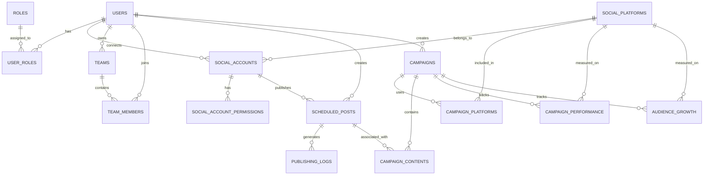

# SocialPilot Database Schema

## Overview

The SocialPilot database supports the complete social media management workflow from user management and social account management to content scheduling, publishing, campaign management, and analytics.

The system uses two databases:

- PostgreSQL — Stores structured relational application data.
- MongoDB — Stores flexible content and media metadata.

### Technologies Used

- PostgreSQL
- MongoDB
- SQLAlchemy
- Alembic
- PyMongo

---

# Database Architecture

## PostgreSQL

PostgreSQL stores structured relational application data including:

- Users
- Roles
- User-role mappings
- Social platforms
- Social accounts
- Social account permissions
- Teams
- Team members
- Scheduled posts
- Publishing logs
- Campaigns
- Campaign-platform mappings
- Campaign-content mappings
- Campaign performance
- Audience growth

Database name:

```text
socialpilot_db
```

## MongoDB

MongoDB stores flexible content and media metadata.

Database name:

```text
socialpilot_db
```

Collections:

```text
content_metadata
media_metadata
```

---

# Milestone 1 – User, Role, Social Account and Team Management

## users

Stores registered users.

Fields:

- id — Primary Key
- name
- email — Unique
- password_hash
- bio
- is_active
- created_at
- updated_at

## roles

Stores roles used for Role-Based Access Control (RBAC).

Fields:

- id — Primary Key
- name — Unique

Default Roles:

- Content Creator
- Marketing Team
- Business User
- Administrator

## user_roles

Maps users to their assigned roles.

Fields:

- user_id — Foreign Key → users.id
- role_id — Foreign Key → roles.id

Primary Key:

```text
(user_id, role_id)
```

Relationship:

- One user can have multiple roles.
- One role can be assigned to multiple users.

## social_platforms

Stores supported social media platforms.

Fields:

- id — Primary Key
- name — Unique

Supported platforms:

- Facebook
- Instagram
- LinkedIn
- X (Twitter)
- YouTube
- Pinterest

## social_accounts

Stores social media accounts connected by users.

Fields:

- id — Primary Key
- user_id — Foreign Key → users.id
- platform_id — Foreign Key → social_platforms.id
- platform_user_id
- username
- access_token
- refresh_token
- token_expires_at
- is_active
- last_synced_at
- created_at
- updated_at

Unique:

```text
(platform_id, platform_user_id)
```

Relationship:

- One user can connect multiple social accounts.
- One social platform can have multiple connected accounts.

## social_account_permissions

Stores permissions granted to connected social accounts.

Fields:

- id — Primary Key
- social_account_id — Foreign Key → social_accounts.id
- permission_name
- is_granted
- created_at

Unique:

```text
(social_account_id, permission_name)
```

Relationship:

- One social account can have multiple permissions.

## teams

Stores teams.

Fields:

- id — Primary Key
- name
- owner_id — Foreign Key → users.id
- created_at

Relationship:

- One user can own multiple teams.
- Each team has one owner.

## team_members

Maps users to teams.

Fields:

- team_id — Foreign Key → teams.id
- user_id — Foreign Key → users.id
- joined_at

Primary Key:

```text
(team_id, user_id)
```

Relationship:

- One team can contain multiple users.
- One user can belong to multiple teams.

---

# Milestone 2 – Content Scheduling and Publishing

## scheduled_posts

Stores posts created by users that are scheduled for future publishing.

Fields:

- id — Primary Key
- user_id — Foreign Key → users.id
- social_account_id — Foreign Key → social_accounts.id
- title
- content
- scheduled_time
- status
- is_recurring
- recurrence_pattern
- created_at
- updated_at

Status values:

```text
Draft
Scheduled
Published
Failed
```

Relationship:

- One user can create many scheduled posts.
- One social account can have many scheduled posts.

## publishing_logs

Stores the publishing history of scheduled posts.

Fields:

- id — Primary Key
- scheduled_post_id — Foreign Key → scheduled_posts.id
- published_at
- status
- platform_response
- error_message
- created_at

Status values:

```text
Success
Failed
```

Relationship:

- One scheduled post can have multiple publishing log entries.

---

# Milestone 3 – Campaign Management and Analytics

Milestone 3 extends the SocialPilot database with campaign management, campaign content tracking, engagement analytics, audience growth tracking, performance metrics, and ROI analysis.

The following tables were added:

- campaigns
- campaign_platforms
- campaign_contents
- campaign_performance
- audience_growth

## campaigns

Stores campaign information.

Fields:

- id — Primary Key
- user_id — Foreign Key → users.id
- name
- start_date
- end_date
- budget
- goal
- status
- created_at
- updated_at

Relationship:

- One user can create multiple campaigns.
- Each campaign belongs to a user.

## campaign_platforms

Maps campaigns to social media platforms.

Fields:

- id — Primary Key
- campaign_id — Foreign Key → campaigns.id
- platform_id — Foreign Key → social_platforms.id

Relationship:

- One campaign can use multiple social media platforms.
- One social platform can be used by multiple campaigns.

This table provides the mapping between campaigns and social platforms.

## campaign_contents

Maps campaigns to scheduled posts.

Fields:

- id — Primary Key
- campaign_id — Foreign Key → campaigns.id
- scheduled_post_id — Foreign Key → scheduled_posts.id
- created_at

Relationship:

- One campaign can contain multiple scheduled posts.
- Scheduled posts from Milestone 2 can be associated with campaigns.

This connects content scheduling with campaign management.

## campaign_performance

Stores campaign performance and engagement metrics.

Fields:

- id — Primary Key
- campaign_id — Foreign Key → campaigns.id
- platform_id — Foreign Key → social_platforms.id
- spend
- impressions
- reach
- likes
- comments
- shares
- conversions
- roi
- recorded_at

Metrics include:

- Spend
- Impressions
- Reach
- Likes
- Comments
- Shares
- Conversions
- ROI

Relationship:

- One campaign can have multiple performance records.
- Performance can be tracked for different social platforms.

## audience_growth

Stores audience and follower growth information.

Fields:

- id — Primary Key
- campaign_id — Foreign Key → campaigns.id
- platform_id — Foreign Key → social_platforms.id
- followers
- recorded_at

Relationship:

- One campaign can have multiple audience growth records.
- Audience growth can be tracked for different social platforms.

---

# Complete Entity Relationship Diagram



---

# Database Relationship Flow

Users
  |
  +---- Roles
  |
  +---- Teams
  |
  +---- Social Accounts
              |
              +---- Social Platforms
              |
              +---- Permissions
              |
              +---- Scheduled Posts
                         |
                         +---- Publishing Logs
                         |
                         +---- Campaign Contents
                                  |
                                  +---- Campaigns
                                         |
                                         +---- Campaign Platforms
                                         |
                                         +---- Campaign Performance
                                         |
                                         +---- Audience Growth

---

# MongoDB

MongoDB is used for flexible data that does not require the same relational structure as PostgreSQL.

Database:

```text
socialpilot_db
```

## content_metadata

Stores flexible metadata associated with social media content.

Example Fields:

- user_id
- title
- content_type
- platforms
- status
- tags
- created_at

Purpose:

- Stores flexible content-related information.
- Supports metadata that may vary between different types of social media content.

## media_metadata

Stores metadata for media files associated with social media content.

Example Fields:

- user_id
- file_name
- media_type
- file_size
- storage_url
- created_at

Purpose:

- Stores media file information.
- Supports flexible metadata for images, videos, and other media.

---

# PostgreSQL and MongoDB Responsibilities

| Database | Purpose |
|---|---|
| PostgreSQL | Structured relational application data |
| MongoDB | Flexible content and media metadata |

PostgreSQL handles:

- User Management
- Role-Based Access Control
- Social Account Management
- Team Management
- Content Scheduling
- Publishing Logs
- Campaign Management
- Campaign-Platform Mapping
- Campaign Content Mapping
- Campaign Performance
- Engagement Analytics
- Audience Growth
- ROI Metrics

MongoDB handles:

- Content Metadata
- Media Metadata

---

# Alembic Migrations

Alembic is used to manage PostgreSQL database schema migrations.

## Milestone 1 migrations

```text
a43fe8bad829_baseline_existing_schema.py
1a2b6503f504_add_bio_to_users.py
```

## Milestone 2 migration

```text
4da2f08bcb8f_add_scheduled_posts_and_publishing_logs.py
```

## Milestone 3 migration

```text
1ecee61dca88_add_campaign_management_and_analytics.py
```

Check current migration:

```text
alembic current
```

Apply migrations:

```text
alembic upgrade head
```

Rollback one migration:

```text
alembic downgrade -1
```

---

# Milestone 1 Database Status

Completed:

- PostgreSQL configured
- MongoDB configured
- User Management schema created
- Role-Based Access Control schema created
- Social Account Management schema created
- Team Management schema created
- SQLAlchemy ORM configured
- PostgreSQL connection configured
- Alembic configured
- Database migrations created
- Database schema documented
- MongoDB connectivity configured

---

# Milestone 2 Database Status

Completed:

- Scheduled posts table created
- Publishing logs table created
- User-to-scheduled-post relationship configured
- Social-account-to-scheduled-post relationship configured
- Scheduled-post-to-publishing-log relationship configured
- Alembic migration created
- Content scheduling database structure implemented
- Publishing history database structure implemented

---

# Milestone 3 Database Status

Completed:

- Campaign database schema created
- Campaign management tables created
- Campaign-platform relationships configured
- Campaign-content relationships configured
- Campaign performance data storage implemented
- Engagement analytics data storage implemented
- Audience growth data storage implemented
- ROI data storage implemented
- Alembic migration created
- Campaign migration applied
- Sample campaign data inserted
- Sample campaign-platform data inserted
- Sample campaign content data inserted
- Sample campaign performance data inserted
- Sample audience growth data inserted
- Database relationships verified
- SQLAlchemy models updated
- PostgreSQL schema updated
- Complete ER diagram documented

---

# Sample Milestone 3 Data

## Sample Campaign

```text
Campaign ID: 1
Campaign Name: MS3 Test Campaign
```

## Sample Campaign Platform

```text
Campaign ID: 1
Platform ID: 2
```

## Sample Scheduled Post

```text
Scheduled Post ID: 1
Title: Milestone 2 Demo Post
Status: Scheduled
```

## Sample Campaign Content

```text
Campaign ID: 1
Scheduled Post ID: 1
```

## Sample Campaign Performance

```text
Campaign ID: 1
Platform ID: 2
Spend: 1200
Impressions: 15000
Reach: 10000
Likes: 850
Comments: 120
Shares: 75
Conversions: 45
ROI: 2.75
```

## Sample Audience Growth

```text
Campaign ID: 1
Platform ID: 2
Followers: 12500
```

---

# Complete SocialPilot Database Workflow

User Registration
       |
       v
Role Assignment
       |
       v
Team Management
       |
       v
Connect Social Media Account
       |
       v
Select Social Platform
       |
       v
Create Social Media Content
       |
       v
Schedule Post
       |
       v
Publish Post
       |
       v
Publishing Logs
       |
       v
Create Campaign
       |
       v
Select Campaign Platforms
       |
       v
Associate Scheduled Content
       |
       v
Track Campaign Performance
       |
       v
Track Engagement
       |
       v
Track Audience Growth
       |
       v
Calculate ROI
       |
       v
Campaign Analytics
       |
       v
Campaign Reports and Comparison

---

# Security Notes

- Never commit the real .env file.
- Environment variables should be used for database credentials.
- Passwords must be stored as secure password hashes and not as plain text.
- OAuth access tokens and refresh tokens are sensitive credentials and require secure handling.
- MongoDB authentication and appropriate access controls should be configured for production deployment.
- Database credentials should never be hard-coded in source files.

---

# Final Database Outcome

The SocialPilot database supports the complete workflow from user and social account management to content scheduling, publishing, campaign management, and analytics.

The database supports:

- User management
- Role-based access control
- Team management
- Social account management
- Social platform management
- Content scheduling
- Publishing history
- Campaign management
- Campaign-platform mapping
- Campaign-content mapping
- Engagement analytics
- Campaign performance tracking
- Audience growth tracking
- ROI metrics
- Campaign reporting and comparison
- Flexible content metadata
- Flexible media metadata

The database is ready to support the SocialPilot end-to-end social media management workflow from content scheduling and publishing to campaign management and analytics.